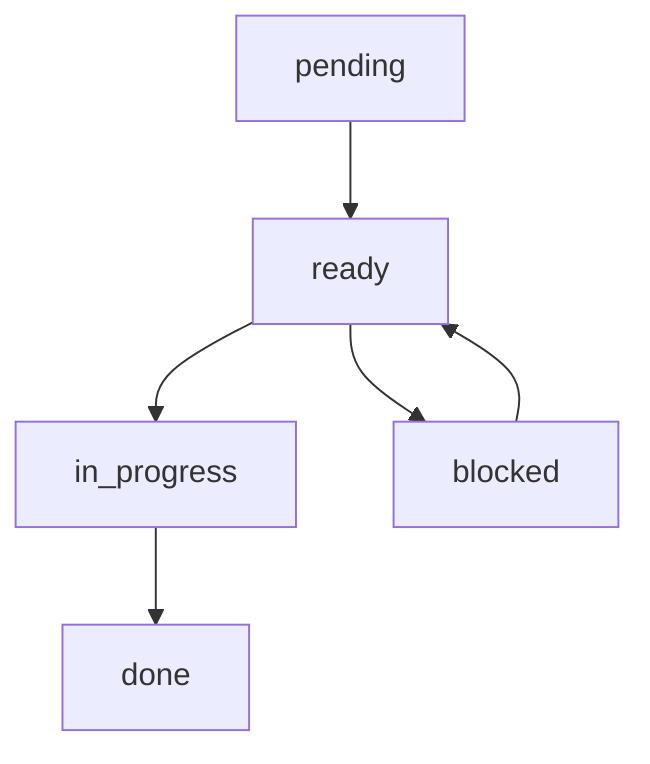

# OpenSpec 工件格式说明

## 工件概述

工件是 OpenSpec 工作流程中的核心概念，每个工件都有特定的格式和用途。工件之间存在依赖关系，确保创建顺序正确。

## 工件类型

### 1. proposal.md - 变更提案

**用途**: 定义变更的"什么"和"为什么"，明确范围和目标。

**创建时机**: 工作流程的起点

**依赖关系**: 无依赖

**格式规范**:

```markdown
# <变更名称> 提案

## 问题描述
清晰描述要解决的问题或要满足的需求。包括：
- 当前痛点
- 业务背景
- 用户需求
- 期望达成的目标

## 解决方案概述
简要描述解决方案的核心思路：
- 主要功能点
- 技术选型
- 架构思路

## 范围
明确界定变更的范围：

### 包含
- [ ] 功能点 1
- [ ] 功能点 2
- [ ] 功能点 3

### 不包含
- [ ] 功能点 4（计划在后续版本）
- [ ] 功能点 5（超出本次 scope）

## 非目标
明确说明本次变更不涉及的内容：
- 性能优化
- 界面美化
- 数据迁移

## 成功标准
定义变更成功的衡量标准：
- [ ] 功能完整性
- [ ] 性能指标
- [ ] 测试覆盖率

## 风险和依赖
识别潜在风险和依赖：
- 技术风险
- 依赖的其他模块
- 外部依赖
- 时间约束

## 相关链接
- 相关需求文档
- 设计参考
- 问题跟踪链接
```

### 2. design.md - 设计文档

**用途**: 详细说明"如何"实现变更，包括架构决策和技术实现。

**创建时机**: proposal.md 完成后

**依赖关系**: 依赖 proposal.md

**格式规范**:

```markdown
# <变更名称> 设计文档

## 架构概览
描述整体架构：
- 系统组件图
- 数据流向
- 关键交互模式

## 技术选型
### 后端技术
- 框架：Spring Boot 2.5.15
- 数据库：MySQL 8.0
- 缓存：Redis
- 消息队列：Kafka

### 前端技术
- 框架：Vue 2
- UI 库：Element UI
- 图表：ECharts

## 数据库设计
### 新增表
```sql
CREATE TABLE example_table (
  id BIGINT PRIMARY KEY AUTO_INCREMENT,
  name VARCHAR(100) NOT NULL,
  status TINYINT DEFAULT 1,
  created_time DATETIME DEFAULT CURRENT_TIMESTAMP,
  updated_time DATETIME DEFAULT CURRENT_TIMESTAMP ON UPDATE CURRENT_TIMESTAMP
);
```

### 表关系
- 表 A → 表 B（一对多）
- 表 B → 表 C（多对一）

## API 设计
### RESTful 接口
```
GET    /api/v1/examples          # 获取列表
GET    /api/v1/examples/{id}    # 获取详情
POST   /api/v1/examples         # 创建
PUT    /api/v1/examples/{id}    # 更新
DELETE /api/v1/examples/{id}    # 删除
```

### 请求/响应示例
```json
// 请求
{
  "name": "示例名称",
  "status": 1
}

// 响应
{
  "code": 200,
  "message": "success",
  "data": {
    "id": 1,
    "name": "示例名称",
    "status": 1,
    "createdTime": "2024-01-01T00:00:00Z"
  }
}
```

## 组件设计
### 后端组件
- Controller: 处理 HTTP 请求
- Service: 业务逻辑
- Repository: 数据访问
- DTO: 数据传输对象

### 前端组件
- View: 页面视图
- Component: 可复用组件
- Store: 状态管理
- API: 接口封装

## 安全设计
### 认证授权
- JWT 认证
- RBAC 权限控制
- 接口权限注解

### 数据安全
- 输入验证
- SQL 注入防护
- XSS 防护

## 性能考虑
### 缓存策略
- Redis 缓存热点数据
- 本地缓存策略

### 数据库优化
- 索引设计
- 查询优化

## 监控和日志
### 监控指标
- 接口响应时间
- 错误率
- 资源使用率

### 日志规范
- 结构化日志
- 日志级别
- 敏感信息过滤

## 部署要求
### 环境要求
- JDK 8+
- MySQL 8.0+
- Redis 5.0+
- Node.js 14+

### 配置文件
- 生产环境配置
- 测试环境配置
- 开发环境配置
```

### 3. specs/ - 规范目录

**用途**: 定义详细的功能规范，包含需求和场景。

**创建时机**: design.md 完成后

**依赖关系**: 依赖 design.md

**目录结构**:
```
specs/
├── authentication/        # 认证模块
│   └── spec.md
├── authorization/         # 授权模块
│   └── spec.md
├── user-management/       # 用户管理
│   └── spec.md
└── ...
```

**格式规范**:

```markdown
# <功能名称> 规范

## Purpose
简要说明功能的目的和价值。

## Requirements
### Requirement: <需求名称>
需求详细描述，使用 SHALL 语句：
- 系统 SHALL 执行某个操作
- 系统 SHALL 验证输入
- 系统 SHALL 返回特定格式

#### Scenario: <场景名称>
使用 GIVEN-WHEN-THEN 格式描述场景：

**GIVEN** <前置条件>
- 系统处于特定状态
- 用户已登录
- 数据已存在

**WHEN** <用户操作>
- 用户执行某个动作
- 系统接收到请求

**THEN** <预期结果>
- 系统执行相应操作
- 返回预期响应
- 数据状态更新

**AND** <附加验证>
- 验证数据一致性
- 验证日志记录
- 验证通知发送

#### Scenario: <边界场景>
- **GIVEN** <特殊情况>
- **WHEN** <执行操作>
- **THEN** <预期错误处理>

#### Scenario: <性能场景>
- **GIVEN** <大量数据>
- **WHEN** <执行查询>
- **THEN** <响应时间 < 100ms>

## Non-Functional Requirements
### 性能要求
- 响应时间 < 200ms
- 并发用户数 > 1000
- 吞吐量 > 1000 TPS

### 安全要求
- 数据加密传输
- 身份验证
- 权限控制

### 可用性要求
- 系统可用性 > 99.9%
- 故障恢复时间 < 5分钟

## Business Rules
- 业务规则 1
- 业务规则 2
- 业务规则 3

## Error Handling
### 错误代码
- 400: 请求参数错误
- 401: 未授权
- 403: 权限不足
- 500: 服务器错误

### 错误消息
- 详细的错误描述
- 建议的解决方案
```

### 4. tasks.md - 实施任务列表

**用途**: 将设计分解为可执行的任务，用于跟踪实施进度。

**创建时机**: design.md 完成后

**依赖关系**: 依赖 design.md

**格式规范**:

```markdown
# <变更名称> 实施任务

## 阶段 1: 环境准备
- [ ] 搭建开发环境
- [ ] 配置开发数据库
- [ ] 初始化 Git 仓库

## 阶段 2: 后端开发
- [ ] 创建模块结构
- [ ] 实现数据模型 (Entity)
- [ ] 实现数据访问层 (Repository)
- [ ] 实现业务逻辑层 (Service)
- [ ] 实现控制层 (Controller)
- [ ] 配置 API 路由

## 阶段 3: 前端开发
- [ ] 创建页面组件
- [ ] 实现数据绑定
- [ ] 添加表单验证
- [ ] 实现列表功能
- [ ] 实现详情页面
- [ ] 添加路由配置

## 阶段 4: 集成测试
- [ ] 编写单元测试
- [ ] 编写集成测试
- [ ] API 接口测试
- [ ] 前端组件测试

## 阶段 5: 部署和验证
- [ ] 配置生产环境
- [ ] 数据库迁移
- [ ] 部署应用
- [ ] 功能验证
- [ ] 性能测试
- [ ] 用户验收测试

## 阶段 6: 文档和交付
- [ ] 更新 API 文档
- [ ] 更新用户手册
- [ ] 部署说明
- [ ] 项目总结
```

## 工件依赖关系

```
proposal.md (无依赖)
    ↓
design.md (依赖 proposal.md)
    ↓
specs/ (依赖 design.md)
    ↓
tasks.md (依赖 design.md)
```

## 工件创建顺序

1. **proposal.md** - 定义变更的基本信息
2. **design.md** - 详细的技术设计
3. **specs/** - 功能规范定义
4. **tasks.md** - 实施任务分解

## 工件状态管理

### 状态定义

- **pending**: 待创建
- **ready**: 依赖已满足，可以创建
- **in_progress**: 正在创建
- **done**: 创建完成
- **blocked**: 被阻塞

### 状态转换



## 工件验证

### 格式验证

- proposal.md: 必须包含问题描述、解决方案、范围
- design.md: 必须包含架构设计、技术选型、API 设计
- specs/: 每个规范必须包含 Purpose、Requirements、Scenarios
- tasks.md: 任务必须可执行、可测试

### 内容验证

- 范围一致性：各工件间的内容必须一致
- 技术可行性：设计方案必须可实现
- 任务完整性：任务必须覆盖所有需要的功能

## 工件更新

### 更新原则

1. **小步快跑**: 频小更新，避免大量修改
2. **及时同步**: 一个工件更新后，及时更新相关工件
3. **版本控制**: 重要更新需要记录变更日志

### 更新流程

1. 识别需要更新的工件
2. 使用 `/opsx-explore` 讨论变更影响
3. 更新相关工件
4. 更新 tasks.md 中的任务
5. 重新检查依赖关系

## 最佳实践

### 1. 保持工件简洁

- 每个工件专注于自己的领域
- 避免在工件间重复内容
- 使用引用而非复制

### 2. 使用标准格式

- 遵循统一的格式规范
- 使用一致的术语
- 保持结构清晰

### 3. 定期评审

- 定期检查工件质量
- 确保内容是最新的
- 收集反馈并改进

### 4. 文档维护

- 及时更新工件
- 记录重要变更
- 维护变更历史

## 故障排除

### 常见问题

1. **依赖循环**
   - 检查工件间的依赖关系
   - 破除循环依赖

2. **内容不一致**
   - 使用 diff 工具比较
   - 确保内容同步更新

3. **任务遗漏**
   - 对照设计文档检查
   - 补充遗漏的任务

### 解决方案

1. **重新生成工件**
   ```bash
   /opsx-propose --regenerate <工件名称>
   ```

2. **手动修复**
   - 使用文本编辑器
   - 遵循格式规范

3. **团队评审**
   - 组织评审会议
   - 收集多方意见